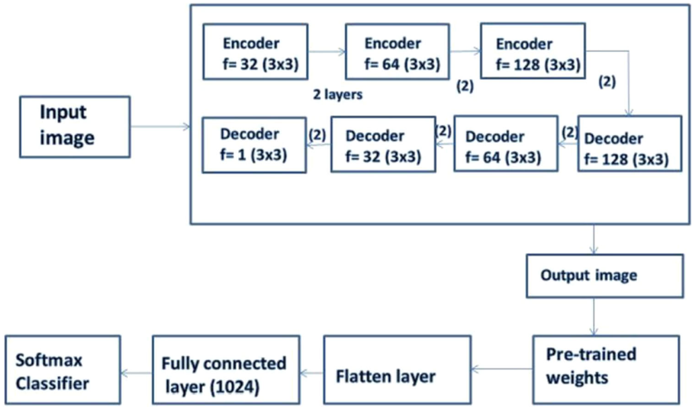
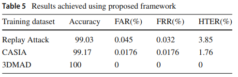
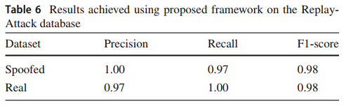
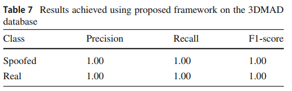

# **Spoofing detection**

[1] : "A robust framework for spoofing detection in faces using deep learning", in *Visual Computer 2021*

## Abstract

- 스푸핑 감지를 위한 프레임워크 제안
- 제안된 프레임워크는 각 얼굴의 특징 추출에 의존
- 제안된 기법은 차원 축소 및 입력 프레임의 특징 추출에 의존
  - 특징 추출은 사전 학습된 conv autoencoder의 가중치 사용

## Introduction

- 기존 보안 기법
  - Knowledge-based methods
    - PW, PINs
  - Ownership-based methods
    - smart codes, tokens
- 때때로 생체 시스템에서의 얼굴인식은 스푸핑 공격에 대한 문제를 무시하곤 함.
- 얼굴 인증 시스템은 진본과 스푸핑을 구별할 수 있는 어떠한 기법이 요구됨.
- 기여
  - Deep convolutional autoencoder를 이용한 차원 축소
    - 모델의 수렴 속도 향상 위함.
  - autoencoder로부터 학습된 가중치 Fine tuning
    - Fine tuning : 기존에 학습되어져 있는 모델을 기반으로 아키텍쳐를 새로운 목적에 맞게 변형하고 이미 학습된 모델 Weights로 부터 학습을 업데이트하는 방법

## Related work

### 1. Conventional methods

- 모션, 질감, 반사 속성 기반
  - 수작업으로 진행
- 알고리즘을 통한 계산
  - Haar-like features, Linear Discriminant Analysis(LDA)
  - CoALBP algorithm : 얼굴의 텍스쳐 특징 추출
  - 2D, 3D Fourier spectra : 주파수 분포의 차이 이용
  - Difference of Gaussian(DoG) filters

### 2. Deep learning based

- using CNN
  - 공간 정보를 통해 얼굴 영역 간 관계 탐색
- Transfer learning
  - 사전 학습된 VGG16의 성능 향상을 위해 사용
- 상기 언급된 두 기법은 좋은 성능을 보였으나, 스푸핑 감지에서는 혼란을 겪음.
- 2개의 CNN 층을 결합한 LSTM 사용
  - 프레임으로부터 임시 정보 캡처
  - 견고한 모델이긴 하나 다중 공격을 제어하지 못함.

### 3. Research gaps

- CNN 기반의 autoencoder 사용은 데이터 압축 향상, 저장 공간 축소, 계산 시간 향상의 이점
- 오직 CNN의 FC 부분만이 학습됨.
  - 나머지는 사전 학습

## Methodology

### 1. Autoencoder

- encoder를 이용해 이미지를 인코딩하고, decoder를 이용해 이미지 X를 재구성
- 제안된 기법에는 encoder, decoder, distance function 필요
  - 원본 입력 이미지와 이미지의 압축된 표현 사이의 손실 매핑을 위해
- Autoencoder는 희소하거나 쌓여있을 수 있음.
  - Sparse autoencoder
    - 입력 벡터 매트릭스와 단일 뉴런 연결
    - 은닉층 출력은 재구성된 출력 벡터 매트릭스이고 이는 디코더 역할
  - stacked autoencoder
    - Sparse autoencoder의 많은 층이 신경망과 연결
    - 출력은 각 은닉 층의 연결된 다음 은닉층의 연결
- autoencoder는 이미지의 차원 축소 기법들 중 우수한 성능을 보임.
- 다른 차원 축소 기법
  - Principal component analysis(PCA) : 차원 d의 선형 subspace 탐색
  - Linear discriminant analysis(LDA) : 새로운 subspace에서 클러스터 간 최대 거리, 최소 거리 탐색
- autoencoder 사용하는 이유
  - 입력 신호들의 인코딩하고, 그들로부터 학습된 출력을 재구성 하는데 도움
  - 중복 특징과 잡음의 양을 감소
  - encoder 부분은 이미지를 잠재 공간으로 매핑하고 디코더는 이미지 재구성
- Comparison
  - PCA 특징은 선형적으로 상관관계가 없는 반면, autoencoder의 특징은 상관관계를 가짐.
  - PCA는 선형 변환을 위해 사용되는 반면, autoencoder는 복잡한 비선형 함수 모델링에 사용
  - PCA에 비해 더 나은 이미지 재구성 제공

### 2. Framework

- 사전 학습된 레이어들은 다시 학습되지 않음.
- advantages
  - 다중 프레임, 특징에서 학습
  - 특징 수를 다운 샘플링하여 이미지 재구성

## Result

